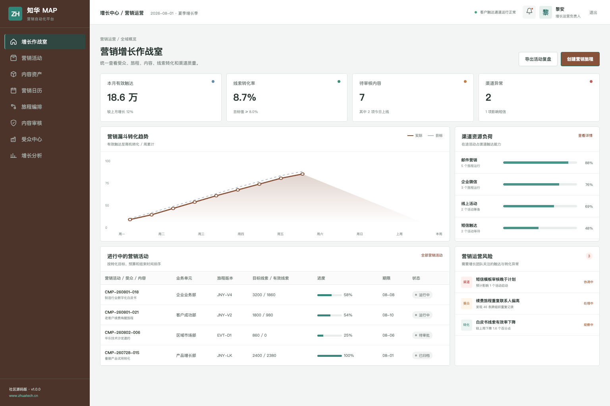
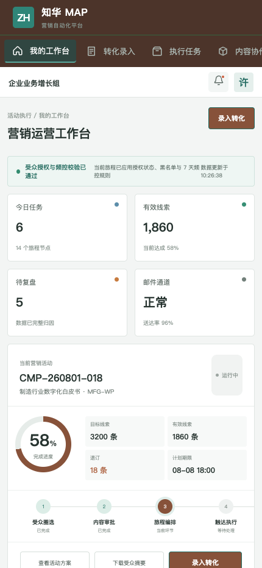

# ZhuaTech MAP

**知华科技营销自动化平台社区源码版**

受众洞察、内容协作、旅程编排、合规触达和收入归因，不再散落于多个工具。ZhuaTech MAP 由知华科技（上海如静知华信息科技有限公司）发布，官方网站：[www.zhuatech.cn](https://www.zhuatech.cn/)。

---

## 一眼看懂营销运行状态

增长管理端面向营销负责人，聚合渠道触达、线索转化、运行中旅程、内容审核和异常提醒。



## 在移动端完成活动执行

营销运营人员可以随时查看活动进度、审核内容、录入线索质量并提交渠道异常。



## 产品设计原则

| 原则 | 落地方式 |
| --- | --- |
| 有授权再触达 | 联系授权、黑名单、退订和频控统一校验 |
| 旅程可解释 | 节点、条件、等待、分支和版本完整留痕 |
| 内容可治理 | 品牌、法务、业务审核与素材版本协作 |
| 增长可衡量 | 从曝光、触达到线索、商机和收入归因 |

核心功能包括客户分群、标签筛选、内容资产、可视化旅程、邮件/短信/企业微信渠道、A/B 实验、转化漏斗与归因分析。演示数据不对应任何真实企业或个人。

## 开发者入口

```bash
cd frontend
npm install
npm run dev:demo
```

打开 `http://localhost:5173`。管理账号为 `planner / Demo@2026`，营销执行账号为 `operator / Demo@2026`。

后端采用 Java 21 + Spring Boot，前端采用 Vue 3 + Vite，数据层为 MySQL 8 + Flyway；同时提供 Docker Compose、JWT 权限、H2 集成测试。Java 包名 `cn.zhuatech.map`，数据库名 `zhuatech_map`。

## 非商业许可

源代码公开不代表允许商业使用。本工程仅供个人学习、研究和非商业技术交流，**任何商业用途必须取得上海如静知华信息科技有限公司书面授权**，包括企业内部生产使用、SaaS、客户交付、收费培训、咨询实施、品牌替换及商业再分发。请阅读 [LICENSE](LICENSE)。

需要 CDP/CRM 对接、全渠道触达、营销中台、私有化部署或深度开发，请访问[知华科技官网](https://www.zhuatech.cn/)或扫码联系：

| 微信二维码 A | 微信二维码 B |
| --- | --- |
|  |  |

关键词：营销自动化系统源码、MAP、营销旅程、客户分群、线索培育、全渠道营销、Java 营销系统、Vue 营销平台、知华科技。
